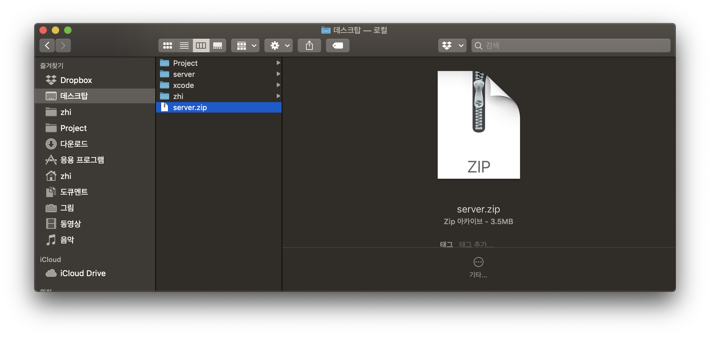
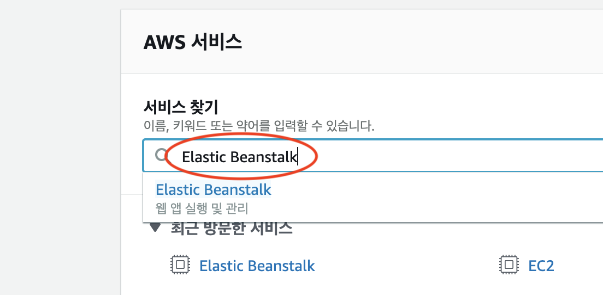
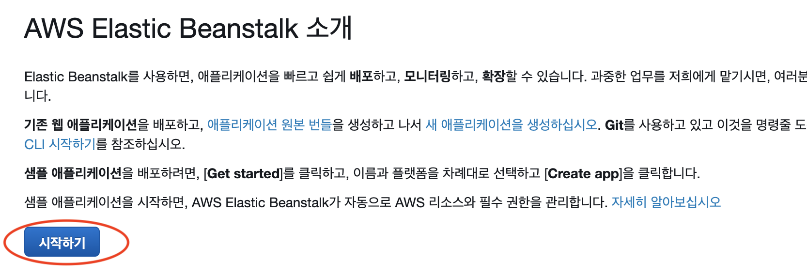
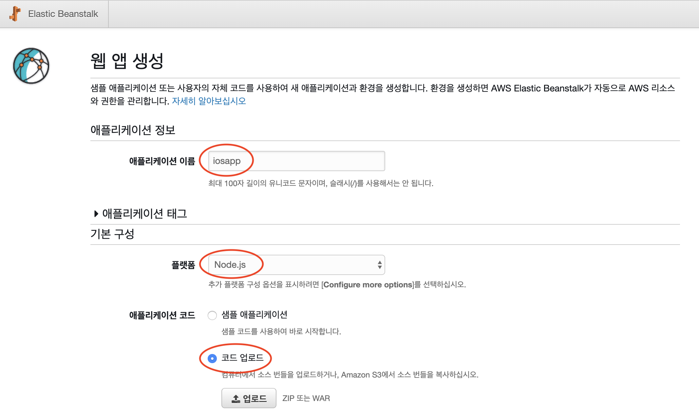
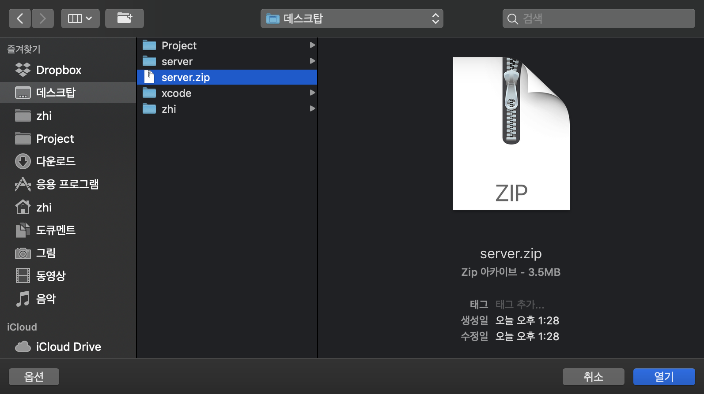
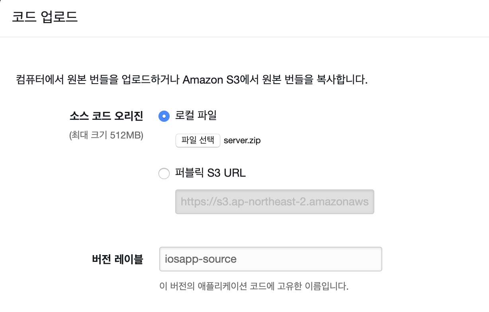
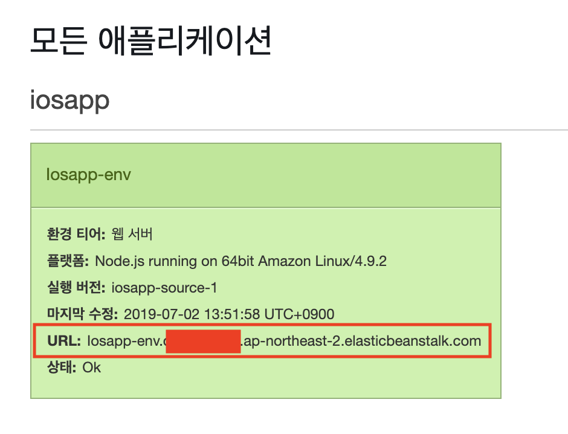

# AUSG-iOS-MapOfRestaurant 🍎

## 1. Node.js 코드 수정

Elastic Beasktalk에 올려서 배포하기 전에 코드를 수정해보겠습니다.

`pakage.json` 파일을 다음과 같이 수정해주세요.

```javascript
{
  "name": "iosapp",
  "version": "1.0.0",
  "description": "iosapp",
  "main": "server.js",
  "scripts": {
    "test": "echo \"Error: no test specified\" && exit 1",
    // 추가 코드
    "start": "node ./server.js"
    //
  },
  "author": "zhi",
  "license": "ISC",
  "dependencies": {
    "body-parser": "^1.19.0",
    "express": "^4.17.1",
    "express-asyncify": "^1.0.0",
    "mysql2": "^1.6.5",
    "sequelize": "^5.9.0"
  }
}
```


`server.js` 파일 가장 아래 쪽 부근에 `3000` -> `process.env.PORT` 으로 수정해주세요.

```javascript
const express = require('express')
const asyncify = require('express-asyncify')
const bodyParser = require('body-parser')
const app = asyncify(express())

...

// 수정 부분
app.listen(process.env.PORT, function () {
  console.log('Example app listening on port!');
})

...

```


모두 수정이 완료 되었으면 `terminal`에서 다음 명령어로 폴더를 압축해주세요.

`server.zip` 파일이 생성되었으면 성공입니다. 

```
$ cd [디렉토리 위치]
$ zip -r ../server ./
```




## 2. Elastic Beanstalk 웹 앱 생성

AWS Console에서 `Elastic Beanstalk`으로 들어가주세요.




`시작하기` 버튼을 눌러서 AWS Elastic Beanstalk을 시작해보겠습니다.




웹 앱 생성 화면에서 아래와 같은 정보로 채워주세요.

- `애플리케이션 이름` : iosapp
- `플랫폼` : `Node.js` 선택
- `애플리케이션 코드` : `코드 업로드` 선택





정보를 다 채운 후에 `업로드` 버튼을 눌러주세요!


`파일 선택`을 눌러 위에서 만들었던 `server.zip` 파일을 업로드 합니다.





다음과 같이 완료가 되면 아래 `업로드` 버튼을 눌러주세요.




`어플리케이션 생성`을 눌러 완료해줍니다. 


생성이 완료되면 해당 URL로 접속이 가능합니다!!





이제 API 서버가 완성 되었으니 iOS 프로젝트로 넘어가볼까요? 🙌

---

- [iOS 앱과 API 서버 연동하기](https://github.com/jaehui327/AUSG-iOS-MapOfRestaurant/blob/master/guide/iOS_guide.md)