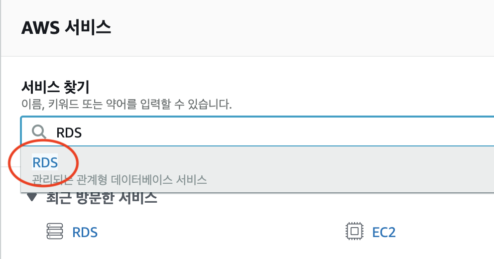
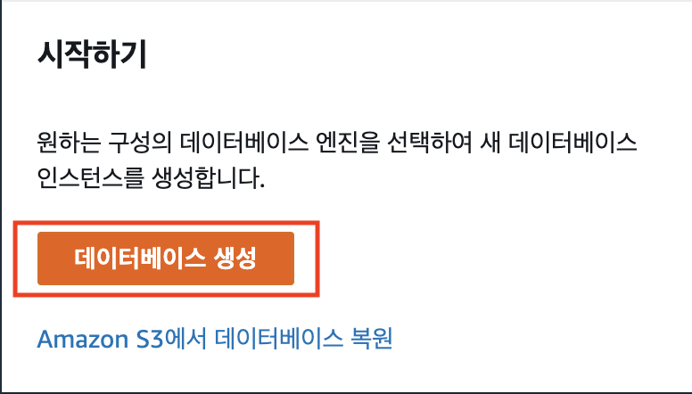
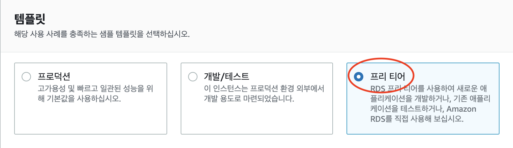
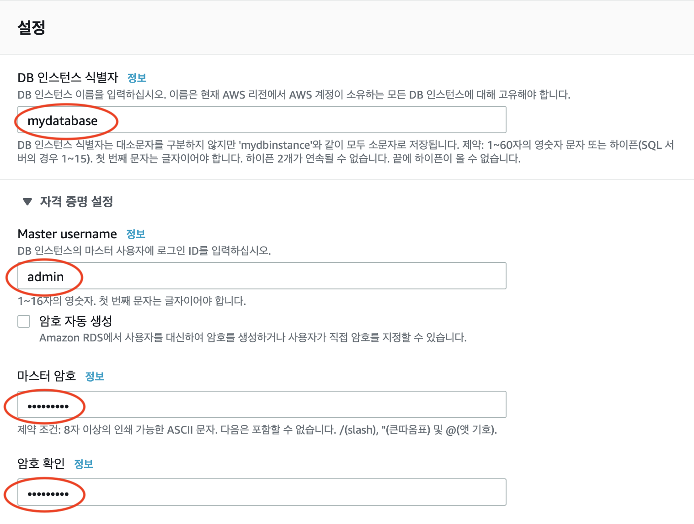
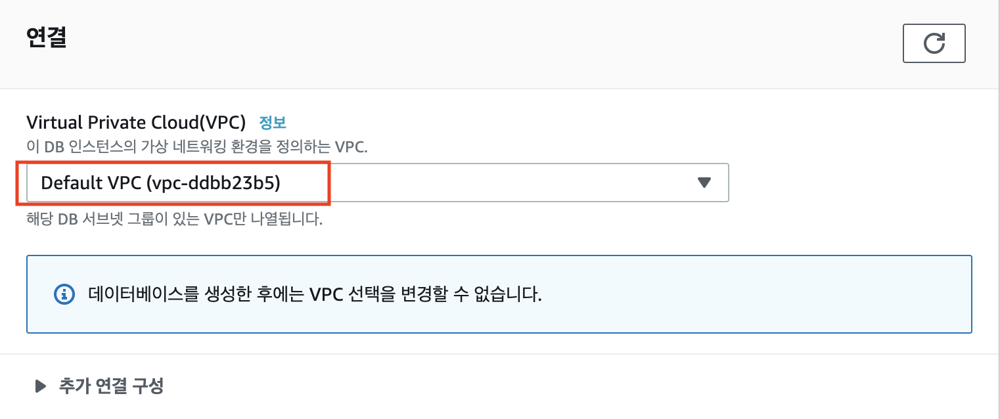
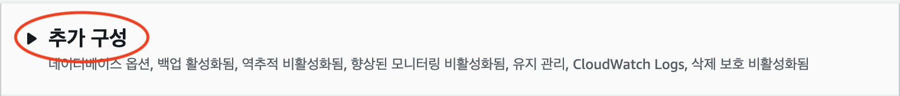
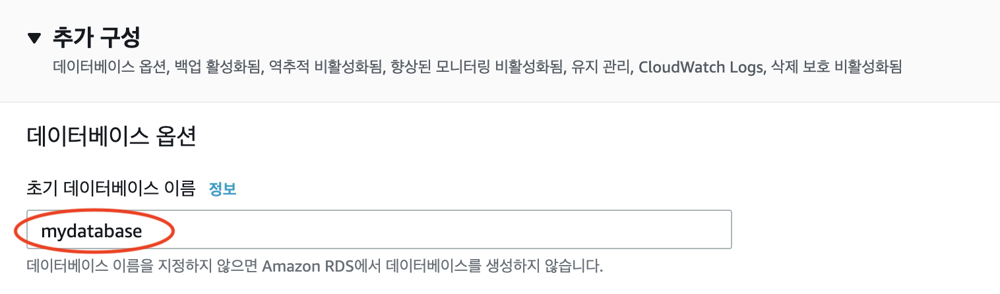
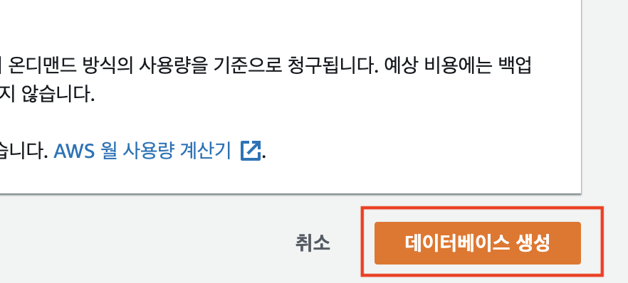

# AUSG-iOS-MapOfRestaurant 🍎  

## RDS 생성하기

### 1. AWS RDS 접속

AWS Console에 접속하여 RDS를 검색 후 RDS 서비스로 접속합니다.

### 2. 데이터베이스 생성

데이터베이스를 생성해보겠습니다. `데이터베이스 생성` 버튼을 눌러주세요.

`엔진 옵션` -> `엔진 유형`에서 `My SQL`을 선택해주세요. 

`템플릿`에서 `프리티어`로 선택해주세요. (과금 방지)

`설정`에서

- `DB 인스턴스 식별자` : mydatabse

- `Master username` : admin

- `마스터 암호` (`암호 확인`) : admin1234

로 설정해주세요.

**이 설정 사항은 꼭 기억해주세요!**

`연결` 탭에서 Default VPC을 선택해주세요.

아래로 내려 `추가 구성` 탭을 열어주세요.

`데이터베이스 옵션` -> `초기 데이터베이스 이름` : mydatabase

로 설정해주세요.

나머지는 원래 설정 그대로 둔 뒤 `데이터베이스 생성`을 클릭합니다.

RDS 생성이 완료되었습니다! 생성될 동안 서버 코드를 만들어보겠습니다.

다음 단계로 넘어가주세요. 😉

---

- [Node.js 코드 만들기](https://github.com/jaehui327/AUSG-iOS-MapOfRestaurant/blob/master/guide/Nodejs_guide.md)

