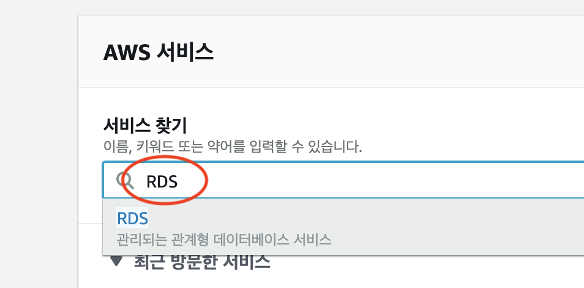
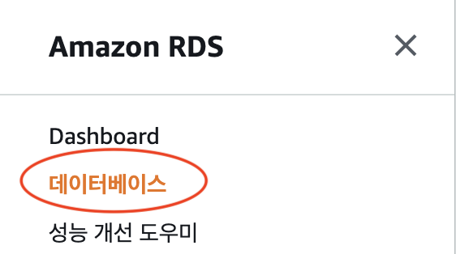
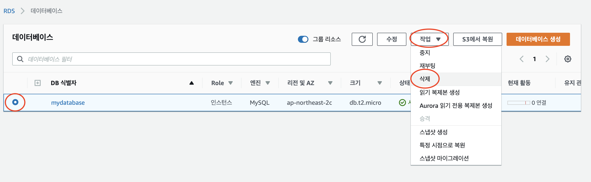
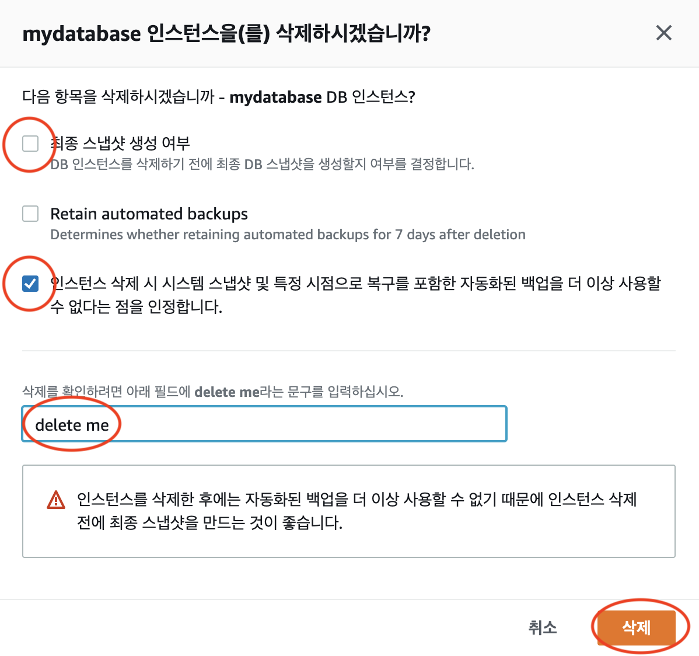
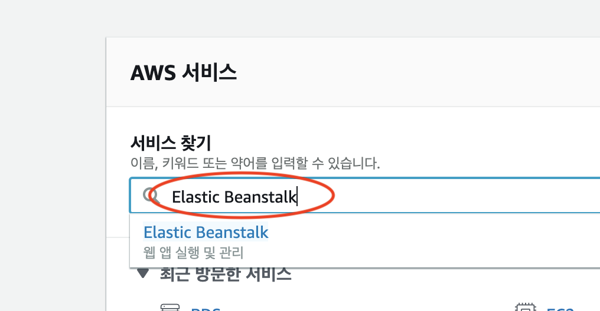
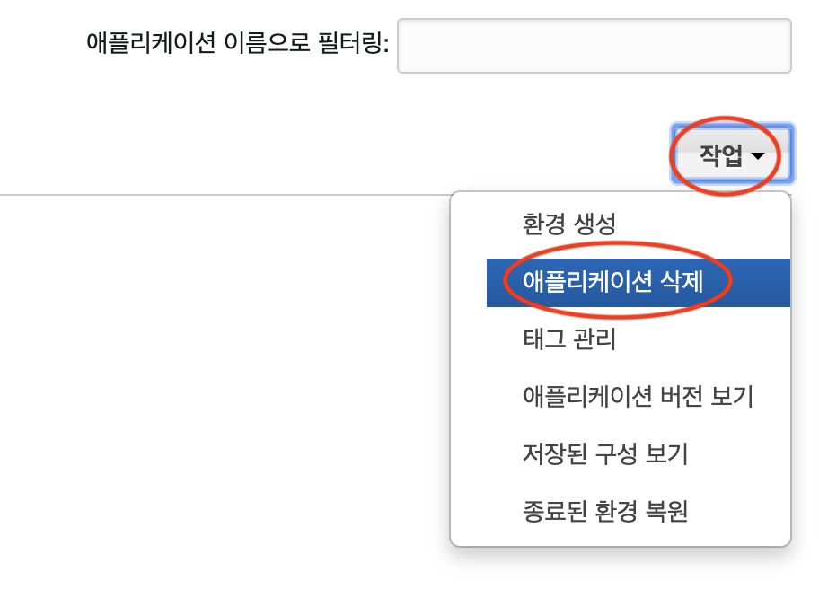
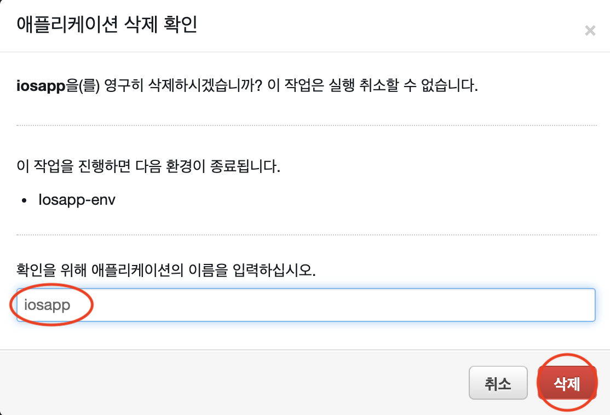

# AUSG-iOS-MapOfRestaurant 🍎

## 삭제 가이드

혹시 모를 요금 과금 방지를 위해 모든 AWS 서비스를 삭제해봅시다!

## 1. RDS 삭제

AWS Console에 접속하여 `RDS`를 검색하여 들어갑니다.

왼쪽 탭에서 `데이터베이스`로 들어갑니다.

생성했던 `DB 식별자`를 선택한 후 `작업` -> `삭제` 를 클릭합니다.

아래 사항들을 모두 수행합니다.

- 최종 스냅샷 생성 여부 : `선택 해제`
- 인스턴스 삭제 시 시스텝 스냅샷 및 특정 시점으로 복구 ~ : `선택`
- 확인 문구 필드 : delete me

완료되면 `삭제` 버튼을 클릭합니다.

`삭제 중`이라고 뜨고 시간이 지나면 완전히 삭제됩니다. 

## 2. Elastic Beanstalk 삭제

AWS Console에 `Elastic Beanstalk` 을 검색하여 들어갑니다.

들어가서 오른쪽 상단에 `작업` 버튼을 눌러 `애플리케이션 삭제` 버튼을 누릅니다.

영구 삭제를 위해 애플리케이션의 이름인 `iosapp` 을 입력하고 `삭제` 버튼을 누르면 삭제됩니다!

### 모든 삭제 과정이 마무리 되었습니다!

### 수고하셨습니다! 👏👏👏